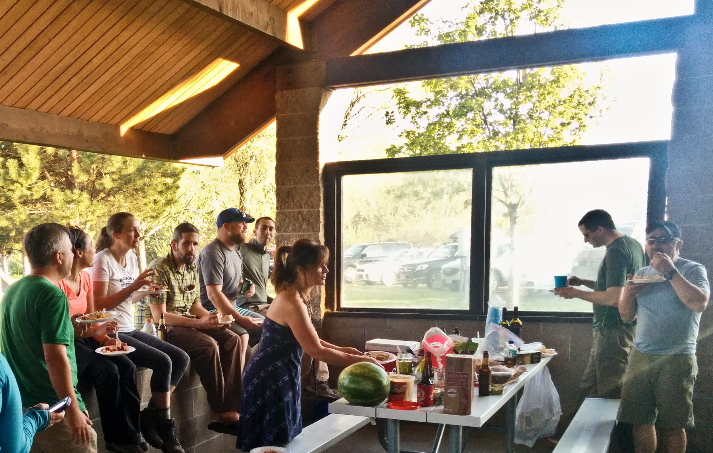

# BCEP Chimney Rock and Horsethief [source](https://github.com/philschatz/photos)

<ol class="carousel-indicators">
<li data-target="#carousel-example-generic" data-slide-to="0" class="active"></li>
<li data-target="#carousel-example-generic" data-slide-to="1"></li>
<li data-target="#carousel-example-generic" data-slide-to="2"></li>
<li data-target="#carousel-example-generic" data-slide-to="3"></li>
<li data-target="#carousel-example-generic" data-slide-to="4"></li>
<li data-target="#carousel-example-generic" data-slide-to="5"></li>
<li data-target="#carousel-example-generic" data-slide-to="6"></li>
<li data-target="#carousel-example-generic" data-slide-to="7"></li>
<li data-target="#carousel-example-generic" data-slide-to="8"></li>
<li data-target="#carousel-example-generic" data-slide-to="9"></li>
<li data-target="#carousel-example-generic" data-slide-to="10"></li>
<li data-target="#carousel-example-generic" data-slide-to="11"></li>
<li data-target="#carousel-example-generic" data-slide-to="12"></li>
<li data-target="#carousel-example-generic" data-slide-to="13"></li>
<li data-target="#carousel-example-generic" data-slide-to="14"></li>
<li data-target="#carousel-example-generic" data-slide-to="15"></li>
<li data-target="#carousel-example-generic" data-slide-to="16"></li>
<li data-target="#carousel-example-generic" data-slide-to="17"></li>
<li data-target="#carousel-example-generic" data-slide-to="18"></li>
<li data-target="#carousel-example-generic" data-slide-to="19"></li>
<li data-target="#carousel-example-generic" data-slide-to="20"></li>
<li data-target="#carousel-example-generic" data-slide-to="21"></li>
<li data-target="#carousel-example-generic" data-slide-to="22"></li>
<li data-target="#carousel-example-generic" data-slide-to="23"></li>
<li data-target="#carousel-example-generic" data-slide-to="24"></li>
<li data-target="#carousel-example-generic" data-slide-to="25"></li>
<li data-target="#carousel-example-generic" data-slide-to="26"></li>
<li data-target="#carousel-example-generic" data-slide-to="27"></li>
<li data-target="#carousel-example-generic" data-slide-to="28"></li>
<li data-target="#carousel-example-generic" data-slide-to="29"></li>
<li data-target="#carousel-example-generic" data-slide-to="30"></li>
<li data-target="#carousel-example-generic" data-slide-to="31"></li>
<li data-target="#carousel-example-generic" data-slide-to="32"></li>
<li data-target="#carousel-example-generic" data-slide-to="33"></li>
<li data-target="#carousel-example-generic" data-slide-to="34"></li>
<li data-target="#carousel-example-generic" data-slide-to="35"></li>
<li data-target="#carousel-example-generic" data-slide-to="36"></li>
<li data-target="#carousel-example-generic" data-slide-to="37"></li>
<li data-target="#carousel-example-generic" data-slide-to="38"></li>
<li data-target="#carousel-example-generic" data-slide-to="39"></li>
<li data-target="#carousel-example-generic" data-slide-to="40"></li>
<li data-target="#carousel-example-generic" data-slide-to="41"></li>
<li data-target="#carousel-example-generic" data-slide-to="42"></li>
<li data-target="#carousel-example-generic" data-slide-to="43"></li>

</ol>

  

  <!-- Controls -->
  <a class="left carousel-control" href="#carousel-example-generic" role="button" data-slide="prev">
    
    Previous
  </a>
  <a class="right carousel-control" href="#carousel-example-generic" role="button" data-slide="next">
    
    Next
  </a>

